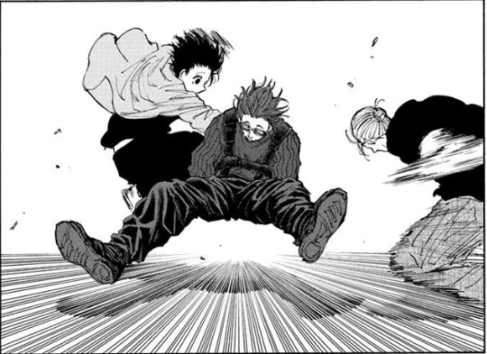

[](https://github.com/gongahkia/kindaka/releases/tag/1.0.0) 

# `Bumi`

Quick and dirty [Strava](https://www.strava.com/dashboard) profile scraper.

Implemented in [1 hour and 31 minutes](https://github.com/gongahkia/kindaka/commit/6b7fab777b775db8cc0502950e3a1e9892c8d1a9) for practise.

## Rationale 

[Strava's official API](https://developers.strava.com/) is [rate limited](https://developers.strava.com/docs/rate-limits/) and its [Athlete profile stats](https://developers.strava.com/docs/reference/#api-Athletes-getStats) are sparse.

[`Kindaka`](https://github.com/gongahkia/kindaka) is open-source and provides unlimited, detailed access to Strava Athelete profiles. 

## Usage

1. Clone [`Kindaka`](https://github.com/gongahkia/kindaka) within your codebase.

```console
$ git clone https://github.com/gongahkia/kindaka
```

2. Call `scrape_strava()` or `scrape_all_strava()`.

```py
import kin

USER_STRAVA_PROFILE = "athlete_id"
result = kin.scrape_strava(USER_STRAVA_PROFILE)

MANY_STRAVA_PROFILES = ["athlete_id_1", "athlete_id_2", "athlete_id_3"]
all_results = kin.scrape_all_strava(MANY_STRAVA_PROFILES)
```

3. Scraped output is returned as a dictionary.

```json
scraped_data = {
    "metadata": {
        "date_time": "",
        "target_url": "",
        "duration": "",
        "num_users": "",
    },
    "user_data": [
        {
            "profile": {
                "athlete_name": "",
                "athlete_profile_image": "",
                "athlete_location": "",
                "athlete_bio": "",
                "athlete_following": "",
                "athlete_followers": "",
                "athlete_clubs": [],
                "athlete_gear": {
                    "shoes": [],
                    "bikes": [],
                }
            },
            "stats": {
                "total_activities_last_month": "",
                "trophies": "",
                "achievements": "",
            },
            "activities": [
                {
                    "activity_name": "",
                    "activity_datetime": "",
                    "activity_description": "",
                    "activity_breakdown": "",
                    "activity_achievements": "",
                }
            ]
        }
    ]
}
```

## Reference

The name `Kindaka` is in reference to [Kindaka](https://sakamoto-days.fandom.com/wiki/Kindaka) (キンダカ), a founding member of the [Order](https://sakamoto-days.fandom.com/wiki/Order) alongside [Satoru Yotsumura](https://sakamoto-days.fandom.com/wiki/Satoru_Yotsumura). He emerges as an ally of [Taro Sakamoto](https://sakamoto-days.fandom.com/wiki/Taro_Sakamoto), [Yoicho Nagumo](https://sakamoto-days.fandom.com/wiki/Yoichi_Nagumo), [Rion Akao](https://sakamoto-days.fandom.com/wiki/Rion_Akao) and [Kei Uzuki](https://sakamoto-days.fandom.com/wiki/Kei_Uzuki) in the [Taro Sakamoto's Past Arc](https://sakamoto-days.fandom.com/wiki/Taro_Sakamoto%27s_Past_Arc) under the ongoing manga series [Sakamoto Days](https://sakamoto-days.fandom.com/wiki/Sakamoto_Days_Wiki).

